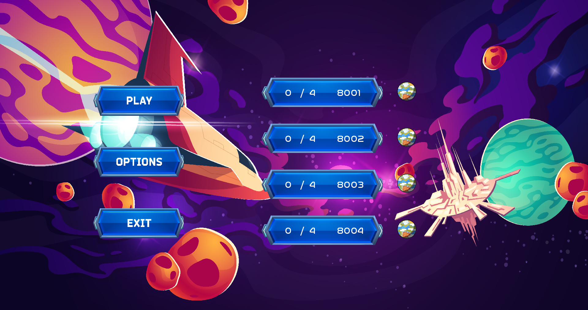
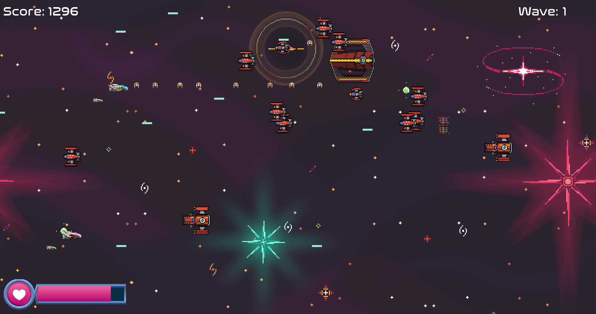

# 🎮 How to play ?

### It is war against Uranus !

The earthling general Greg Goose is trying to reduce the Uranus population of aliens to slavery. Help him taking control of the planet and expand our conquest on the solar system.

Aliens have different types of warships, we will let you discover them when battling against them, they also called their allies the Janitors to help them defend their territory.

Your mission is to fight them until their leader have no choice to come fight you and your allies.\
Their leader is called the **NoodleMonster** and is giant from the rumors, good luck taking him down...

### Joining a battle

Before going into war, you will see a menu in your warship, click on PLAY and choose the battle you want to join.

<figure><figcaption>
Lobby menu
</figcaption></figure>

### Fight !

When you approach Uranus, you will have time to learn how to maneuver your brand new ship, try moving in all the directions with ZQSD !

Now that you know how too move, what about guns ? You like guns ? Me too, press space to shoot !

No time to loose, go fight this pack of aliens, kill them all but take care of your ship, don't get shot.

<figure><figcaption>
Fight !
</figcaption></figure>
